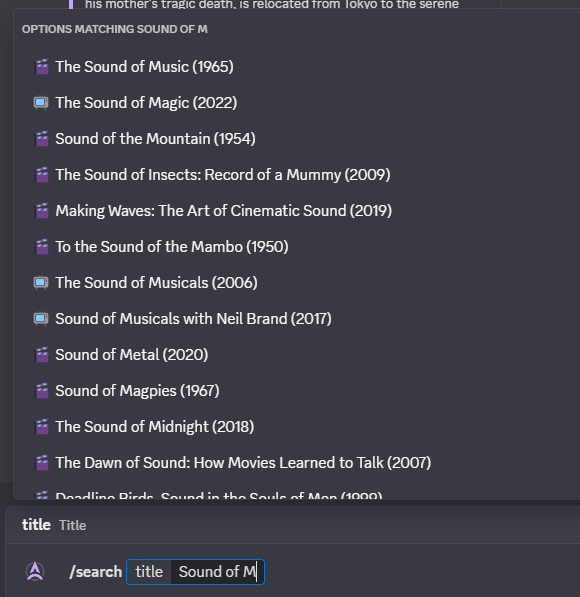
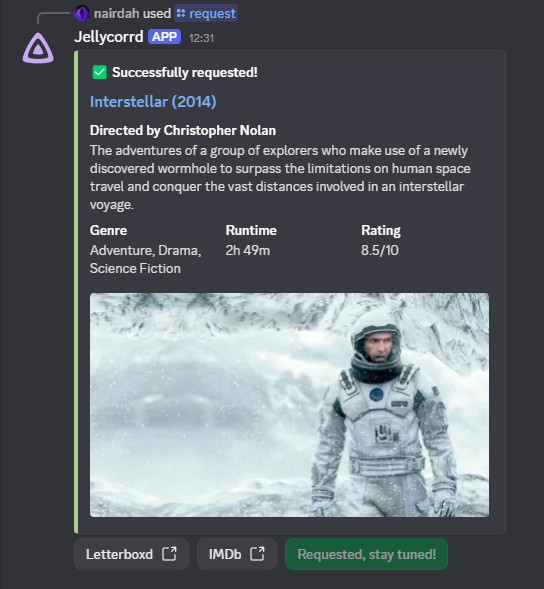
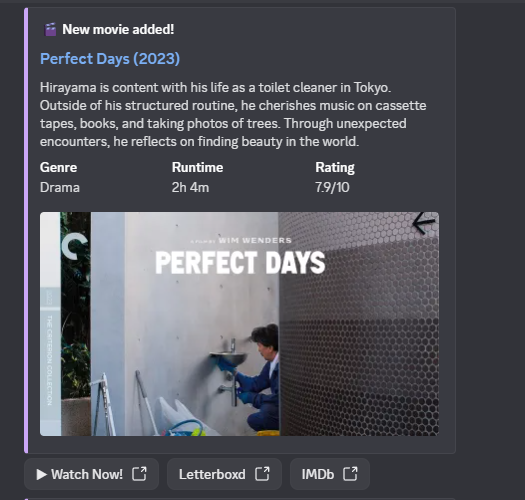

<p align="center">
  
</p>

# Jellycorrd

**Jellycorrd** — a small Discord bot that lets you request movies/TV via Jellyseerr and receives Jellyfin "item added" notifications in Discord.  
Use slash commands to search/request (TMDB and OMDB-backed) and get pretty embeds when content shows up on your server.

## Features

- `/search <title>` — search TMDB and show details in an embed; from the embed you can Request.
- `/request <title>` — send a request immediately to Jellyseerr.
- Receives Jellyfin-style webhooks and posts Add notifications into a configured Discord channel (embed with director, short summary, runtime, rating, and quick buttons).
- Optional OMDb lookup for IMDb rating / director / actors.

## Prerequisites

Before you begin, ensure you have the following:

- A running **Jellyfin** server.
- A running **Jellyseerr** instance.
- A **Discord account** and a server where you have administrative privileges.
- API keys from:
  - **The Movie Database (TMDB)**
  - **OMDb API** (Optional, but recommended for richer data)
- **Node.js** (version 18.x or later).
- **Docker** and **Docker Compose** (if you choose the Docker installation method).

## Quickstart — self-host (recommended for most users)

This project is intended to be self-hosted by each user (so everyone keeps their own API keys).  
The bot will also available as a hosted Discord bot (maintainer-hosted) soon.

1. **Clone the repo**

   ```bash
   git clone https://github.com/nairdahh/jellycorrd.git
   cd jellycorrd
   ```

2. **Copy and fill .env**

   ```bash
   cp .env.example .env
   ```

3. **Run with Node (dev)**
   ```bash
   npm install
   node app.js
   ```
4. **Or run with Docker Compose**
   ```bash
   docker compose up -d --build
   ```
5. **Set up Jellyfin webhook**  
   In Jellyfin (server settings → Webhooks) add your webhook URL:

   ```bash
   http://<your-host-ip>:<WEBHOOK_PORT>/jellyfin-webhook

   ```

   Example: `http://192.168.1.100:8282/jellyfin-webhook`

6. **Invite bot to your server**  
   Create a Discord Application, create a Bot, copy the DISCORD_TOKEN to .env
   Generate an invite link with scopes bot and applications.commands. Give minimal permissions (Send Messages, Embed Links).

## Configuration

Jellycorrd is configured using a `.env` file. Copy the `.env.example` to `.env` and fill in the values:

- `DISCORD_TOKEN`: Your bot's unique token. Think of it as the bot's password. You can get this from the "Bot" section of your application in the Discord Developer Portal.
- `BOT_ID`: The Client ID of your bot. Find this on the "General Information" page of your Discord application.
- `GUILD_ID`: The ID of the Discord server where you will use the bot. Enable Developer Mode in Discord, then right-click your server icon and "Copy Server ID".

- `JELLYSEERR_URL`: The full URL to your Jellyseerr API. This is typically `http://<your-ip>:5055/api/v1`.
- `JELLYSEERR_API_KEY`: Your API key from Jellyseerr. Find it in your Jellyseerr settings under `Settings` -> `API Keys`.

- `TMDB_API_KEY`: Your API key from The Movie Database (TMDB). You can get one by creating an account on their website.
- `OMDB_API_KEY`: (Optional) Your API key from OMDb API for fetching IMDb ratings, director, and actor information.

- `JELLYFIN_BASE_URL`: The publicly accessible URL of your Jellyfin server. **This must be reachable from the internet** for the "Watch Now" links in Discord to work for other users.
  - **Correct examples:** `http://jellyfin.yourdomain.com` or `http://88.99.100.101:8096` (if using a public IP).
  - **Note:** Using `localhost` or a local network IP (e.g., `192.168.1.100`) will only work for users on the same local network as the server.
- `JELLYFIN_SERVER_ID`: The unique ID of your Jellyfin server. You can find this by navigating to any item in your library; it's the `serverId` parameter in the URL.
- `JELLYFIN_CHANNEL_ID`: The ID of the Discord text channel where you want to receive notifications about new media. Enable Developer Mode, right-click the channel, and "Copy Channel ID".

- `WEBHOOK_PORT`: The network port the bot will listen on for incoming webhooks from Jellyfin. The default is `8282`.

## Commands & usage

`/search <title>` — opens interactive embed; use the Request button to send to Jellyseerr.  
`/request <title>` — instantly request the title.

When Jellyfin (or your add pipeline) sends a webhook to `http://<host>:<port>/jellyfin-webhook`, the bot will post the notification to the configured Discord channel.

## Publishing & Docker (optional)

A Dockerfile is provided in the repo. Use docker compose up -d to run.

Keep secrets out of the repo (use .env only).

GitHub Actions can be set up to build/push images to GHCR or Docker Hub.

## Screenshots

  
  



## Contributing

Contributions are always welcome!

See `contributing.md` for ways to get started.

## License

This repo is released under the Unlicense — public domain. Do anything with the code.
