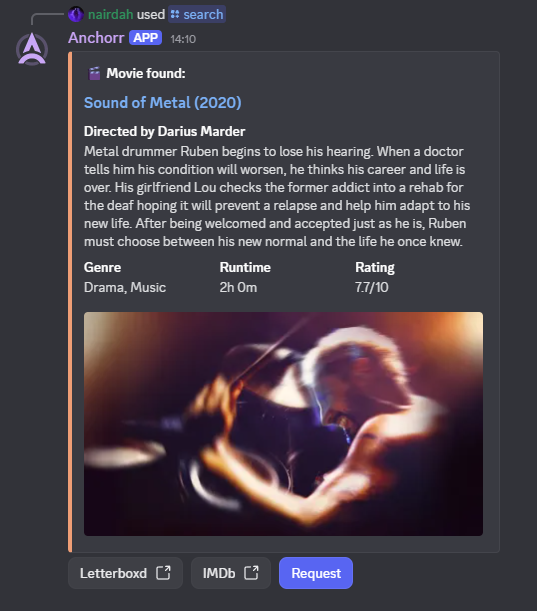
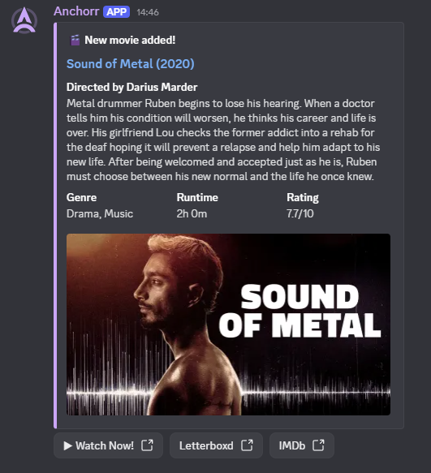

<p align="center">
  
</p>

<p align="center">
  <strong>A helpful Discord bot for requesting media via Jellyseerr and receiving Jellyfin notifications for new content in your library.</strong>
</p>

<p align="center">
  <a href="#-features">Features</a> • 
  <a href="#-quick-start">Quick Start</a> • 
  <a href="#-configuration">Configuration</a> • 
  <a href="#-commands">Commands</a> •
  <a href="#-docker-deployment">Docker</a> •
  <a href="./CHANGELOG.md">Changelog</a> •
  <a href="./CONTRIBUTING.md">Contributing</a>
</p>

## 🌟 Features

- **🔍 Media Search**: Search for movies and TV shows with `/search` command - you can then request it later within the message embed
- **🔥 Trending Content**: Browse weekly trending movies and TV shows with `/trending` command
- **📤 One-Click Requests**: Directly request media to Jellyseerr with `/request` command
- **📺 Smart TV Handling**: Choose specific seasons when searching for TV series using `/search`, or request all the seasons at once with `/request`
- **🚫 Duplicate Detection**: Automatically checks if content already exists in Jellyseerr before allowing requests
- **🏷️ Tag Selection**: Select Radarr/Sonarr tags when requesting media for better organization and categorization
- **📬 Jellyfin Notifications**: Automatic Discord notifications when new media is added to your library
- **📚 Library Filtering**: Choose which Jellyfin libraries send Discord notifications
- **👤 User Mapping**: Map Discord users to Jellyseerr accounts so requests appear from the correct user
- **🔐 Role-Based Permissions**: Control who can use bot commands through Discord roles (allowlist/blocklist)
- **🔔 Private Notifications**: Optional PM when your requested content becomes available on Jellyfin
- **👻 Ephemeral Mode**: Make bot responses visible only to the command user
- **🎨 Rich Embeds**: Beautiful, detailed embeds with:
  - Movie/TV show posters and backdrops
  - Director/Creator information
  - IMDb ratings and links
  - Runtime, genres, and synopsis
  - Quick action buttons (IMDb, Letterboxd, Watch Now)
- **🔗 Autocomplete Support**: Intelligent autocomplete for search queries with rich metadata
- **⚙️ Web Dashboard**: User-friendly web interface for configuration with auto-detection

## 📋 Prerequisites

Before getting started, ensure you have:

- ✅ A running **Jellyfin** server
- ✅ A running **Jellyseerr** instance
- ✅ A **Discord account** with a server where you have admin privileges
- ✅ API keys from:
  - [The Movie Database (TMDB)](https://www.themoviedb.org/settings/api) - **Required**
  - [OMDb API](http://www.omdbapi.com/apikey.aspx) - Optional, but recommended for richer data
- ✅ **Node.js** v18+ or **Docker & Docker Compose**

## 🚀 Quick Start

### 1️⃣ Clone and Install

```bash
git clone https://github.com/nairdahh/anchorr.git
cd anchorr
npm install
```

### 2️⃣ Start the Application

```bash
node app.js
```

The web dashboard will be available at `http://localhost:8282`

### 3️⃣ Configure via Web Dashboard

1. Open `http://localhost:8282` in your browser
2. Fill in your Discord Bot credentials, API keys, and service URLs
3. Click the test buttons to verify connections
4. Start the bot using the dashboard button

### 4️⃣ Invite Bot to Discord

Generate an OAuth2 URL in [Discord Developer Portal](https://discord.com/developers/applications):

- OAuth2 → URL Generator
- Scopes: `bot`, `applications.commands`
- Permissions: Send Messages, Embed Links
- Copy generated URL and open in browser

### 5️⃣ Configure Jellyfin Webhook

In Jellyfin Dashboard → Webhooks:

1. Click **+** to add new Discord webhook
2. Enter URL: `http://<bot-host>:<port>/jellyfin-webhook`
3. Example: `http://192.168.1.100:8282/jellyfin-webhook`
4. Save and you're done! 🎉

## ⚙️ Configuration

Configuration is managed through a **web dashboard** at `http://localhost:8282/`. However, you can also configure it programmatically.

## 🐳 Docker Deployment

Deploying with Docker is the recommended method for running Anchorr. You can use Docker Compose (the easiest way) or run the container manually.

### Method 1: Docker Compose

**Option A: Clone the full repository**
```bash
git clone https://github.com/nairdahh/anchorr.git
cd anchorr
docker compose up -d
```

**Option B: Download only docker-compose.yml**
```bash
mkdir anchorr && cd anchorr
wget https://raw.githubusercontent.com/nairdahh/anchorr/main/docker-compose.yml
# OR with curl: curl -O https://raw.githubusercontent.com/nairdahh/anchorr/main/docker-compose.yml
docker compose up -d
```

**Access:** Open browser at `http://<your-server-ip>:8282` (e.g., `http://192.168.1.100:8282` or `http://localhost:8282`)

### Method 2: Manual Docker Run

```bash
# Run container (using port 8282)
docker run -d \
  --name anchorr \
  -p 8282:8282 \
  -v $(pwd)/anchorr-data:/config \
  --restart unless-stopped \
  nairdah/anchorr:latest
```

**Access:** Open browser at `http://<your-server-ip>:8282`

**Important parameters:**
- `-p 8282:8282` - **Port mapping** (host:container). First number is the port on your host.
- `-v $(pwd)/anchorr-data:/config` - Persistent data storage
- `--restart unless-stopped` - Auto-restart on failure

**Example for Unraid:**
When adding the container in Unraid Community Apps, add this volume mapping in the "Path" section:
- **Container Path**: `/config`
- **Host Path**: `/mnt/user/appdata/anchorr`
- **Access Mode**: `RW` (Read-Write)

### Using a Different Port

If port 8282 is already in use:

**Docker Compose:** Edit `docker-compose.yml`
```yaml
ports:
  - "9000:8282"  # Change 9000 to your desired port
```

**Docker Run:** Change the first port number
```bash
docker run -d \
  --name anchorr \
  -p 9000:8282 \              # Use port 9000 on host
  -v $(pwd)/anchorr-data:/config \
  --restart unless-stopped \
  nairdah/anchorr:latest
```
Then access at: `http://localhost:9000`

## 📸 Screenshots (a bit outdated for now)

| Feature               | Screenshot                                            |
| --------------------- | ----------------------------------------------------- |
| Autocomplete          |  |
| Search Results        |              |
| Request Confirmation  |            |
| Jellyfin Notification |         |

## 🤝 Contributing

Contributions are welcome! See [CONTRIBUTING.md](./CONTRIBUTING.md) for guidelines.

## 📄 License

This project is released under the **Unlicense** — it's public domain. Do anything you want with the code!
